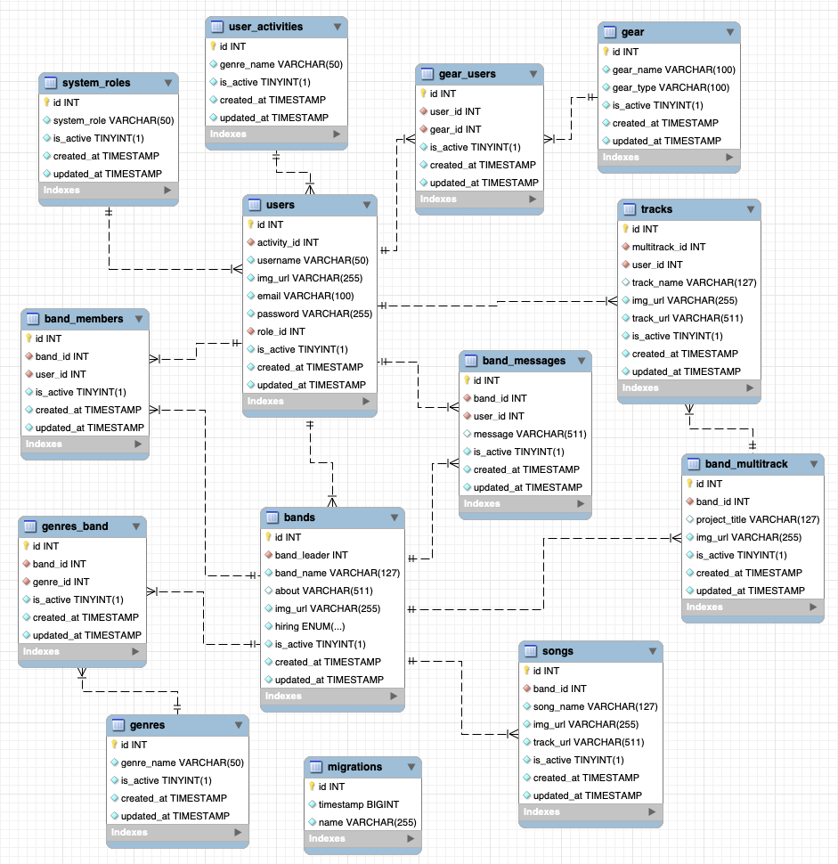

# truck4tracks API
#### by Paco Fuentes


---

<details>
  <summary>Content 📝</summary>
  <ol>
    <li><a href="#objective">Objective</a></li>
    <li><a href="#about-the-project">About the Project</a></li>
    <li><a href="#deployment-🚀">Deployment</a></li>
    <li><a href="#stack">Stack</a></li>
    <li><a href="#database-diagram">Database Diagram</a></li>
    <li><a href="#local-installation">Installation</a></li>
    <li><a href="#endpoints">Endpoints</a></li>
    <li><a href="#future-features">Future Features</a></li>
    <li><a href="#contributions">Contributions</a></li>
    <li><a href="#license">License</a></li>
    <li><a href="#contact">Contact</a></li>
  </ol>
</details>

---

## Objective

The goal of this API is to create a network of tables using Node with Express and a relational database with MySQL. It will contain complementary and independent data to later handle complex search fields through user roles on the platform, equipment, and musical styles. Additionally, it will manage a group within another group, as is the case with a playlist integrated into a group. Finally, a real-time chat messaging system will be implemented.

---

## About the Project 🔎

API for CRUD management system for a sound and music social network MVP, emphasizing sound sharing and fostering collaborative composition creation among users. This project represents the culmination of the GeeksHubs Academy fullstack developer bootcamp.

 ---

## Deployment 🚀
<div align="center">
   🚀🚀🚀 <a href="https://despliegue.dkttbnrz8nnws.amplifyapp.com/"><strong>URL to AWS test deploy</strong></a> 🚀🚀🚀
</div>

---

## Stack
Used tech stacks:
<div align="center">
  <a href="https://www.mysql.com/">
    
  </a>
  <a href="https://www.expressjs.com/">
    
  </a>
  <a href="https://nodejs.org/es/">
    
  </a>
   <a href="https://www.npmjs.com/">
    
  </a>
  <a href="https://www.typescriptlang.org/">
    
  </a>
  <a href="https://jwt.io//">
    
  </a>
  <a href="https://www.postman.com/">
    
  </a>
  <br>
  <a href="https://www.npmjs.com/package/nodemon">
    
  </a>
  <a href="https://typeorm.io/">
    
  </a>
  <a href="https://www.npmjs.com/package/bcrypt">
    
  </a>
  <a href="https://git-scm.com/">
    
  </a>
</div>

---

## Database Diagram


---

## Local Installation
1. Clone the repository and run the following command to install the necessary dependencies:
```$ npm install```
2. Connect your repository to the database by following the instructions in the env.example file, where the JWT key is also stored.
3. Run migrations:
``` $ npx typeorm-ts-node-commonjs migration:run -d ./src/db.ts ``` 
4. Run developer:
``` $ npm run dev ``` 
5. Execute the endpoints using Postman with the included http-tattoo-studio.postman_collection.json in the "./http" directory.
7. You can also compile to JavaScript and run the project with the following commands:
 ``` $ npm run build ```
 ``` $ npm run start ```

---

## Endpoints
<details>
<summary>Endpoints</summary>


### Test API connection

GET
healthyCatCheck
http://localhost:4000/api/healthycat


### User

POST
register
http://localhost:4000/api/user/register


    Body
    raw (json)
    json
    {
        "activity_id": 1,
        "username": "simon",
        "email": "simon@simon.com",
        "password": "Pass1234&"
    }
POST
login
http://localhost:4000/api/user/login


    Body
    raw (json)
    json
    {
        "email": "simon@simon.com",
        "password": "Pass1234&"
    }
POST
login_paco
http://localhost:4000/api/user/login


GET
profile
http://localhost:4000/api/user/profile


    Authorization
    Bearer Token
    Token
    <token>
PUT
updateProfile
http://localhost:4000/api/user/profile


    Authorization
    Bearer Token
    Token
    <token>
    Body
    raw (json)
    json
    {
        "activity_id": 2,
        "username": "simon",
        "email": "simon@simon.com",
        "password": "Pass1234&",
        "img_url": "'default'",
        "is_active":"false"
    }
POST
register_paco
http://localhost:4000/api/user/register


    Body
    raw (json)
    json
    {
        "activity_id": 1,
        "username": "paco",
        "email": "paco@paco.com",
        "password": "Pass1234&"
    }
POST
joinBand
http://localhost:4000/api/user/joinband


    Authorization
    Bearer Token
    Token
    <token>
    Body
    raw (json)
    json
    {
        "band_id": 1
    }
POST
leaveBand
http://localhost:4000/api/user/leaveband


    Authorization
    Bearer Token
    Token
    <token>
    Body
    raw (json)
    json
    {
        "band_id": 1
    }
    Band


POST
registerBand
http://localhost:4000/api/band/register


    Authorization
    Bearer Token
    Token
    <token>
    Body
    raw (json)
    json
    {
        "band_name": "Los Simones",
        "about": "Somos una banda de valencia compuesta por simones"
    }
GET
getBandByAuthTokenId
http://localhost:4000/api/band/myband


    Authorization
    Bearer Token
    Token
    <token>
    Body
    raw (json)
    json
    {
        "band_name": "Los Simones",
        "about": "Somos una banda de valencia compuesta por simones"
    }
GET
allBands
http://localhost:4000/api/band/all


GET
selectedBand
http://localhost:4000/api/band/selected


    Body
    raw (json)
    json
    {
        "band_id": 1
    }
GET
getBandById
http://localhost:4000/api/band/1


GET
isBandMamber
http://localhost:4000/api/user/ismember/1


    Authorization
    Bearer Token
    Token
    <token>
GET
getMembersByParamsBandPage
http://localhost:4000/api/user/bandmembers/1


    Authorization
    Bearer Token
    Token
    <token>
POST
kickBandMamberAsLeader
http://localhost:4000/api/user/kickmember


    Authorization
    Bearer Token
    Token
    <token>
    Body
    raw (json)
    json
    {
        "band_id": 1,
        "user_id": 4
    }

### Message


POST
postMessage
http://localhost:4000/api/messages/band/1


    Authorization
    Bearer Token
    Token
    <token>
    Body
    raw (json)
    json
    {
        "message": "y este el segundo : ) "
    }
GET
getAllBandMessages
http://localhost:4000/api/messages/band/1


    Authorization
    Bearer Token
    Token
    <token>
    Body
    raw (json)
    json
    {
        "message": "y este el segundo : ) "
    }
PUT
updateMessage
http://localhost:4000/api/messages/band/1


    Authorization
    Bearer Token
    Token
    <token>
    Body
    raw (json)
    json
    {
        "message_id": 2,
        "message": "y este el segundo : ) editadoooo "
    }
DELETE
deleteMessage
http://localhost:4000/api/messages/band/1


    Authorization
    Bearer Token
    Token
    <token>
    Body
    raw (json)
    json
    {
        "message_id": 2
    }

### Admin


POST
adminLogin
http://localhost:4000/api/user/login


    Body
    raw (json)
    json
    {
        "email": "admin@admin.com",
        "password": "Pass1234&"
    }
GET
getAllusers
http://localhost:4000/api/admin/allusers


DELETE
deleteUserByBodyId
http://localhost:4000/api/admin/usertoremove


    Authorization
    Bearer Token
    Token
    <token>
    Body
    raw (json)
    json
    {
        "id": 22
    }

### Multitrack


POST
loginSara
http://localhost:4000/api/user/login


    Body
    raw (json)
    json
    {
        "email": "sara@sara.com",
        "password": "Pass1234&"
    }
POST
createMultitrack
http://localhost:4000/api/multitrack/create


POST
loadTrack
http://localhost:4000/api/multitrack/loadtrack/1111


    Authorization
    Bearer Token
    Token
    <token>
    Body
    raw (json)
    View More
    json
    {
        "id": 8,
        "track_name": "Una canción que hice",
        "img_url": "https://img.freepik.com/premium-vector/vinyl-record-disc-hand-drawn-engraving-style-sketch-vector-illustration_666729-557.jpg",
        "track_url": "https://actions.google.com/sounds/v1/science_fiction/alien_beam.ogg?hl=es-419"
    }


</details>

---

## License

This project is under a MIT license.

## Contact

Paco Fuentes. 2024

<a href = "mailto:pacofuentes.work@gmail.com"></a>
<a href="https://www.linkedin.com/in/paco-fuentes-805a40290/" target="_blank"></a> 
</p>
