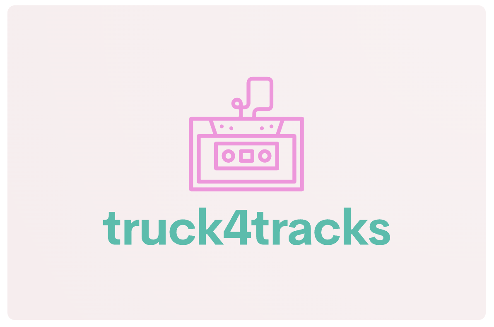

<!-- # truck4tracks API -->

## About the Project
Backend API of crud management system for a sound and music social network MVP.

## Deploy 🚀

    <a href="https://www.google.com"><strong>Url deployment coming soon... </strong></a>🚀🚀🚀

## Stack
Used stacks:

 
